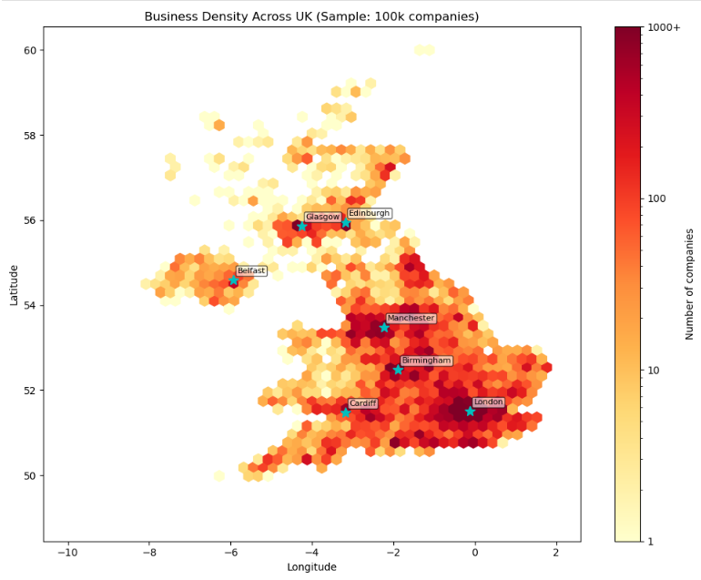
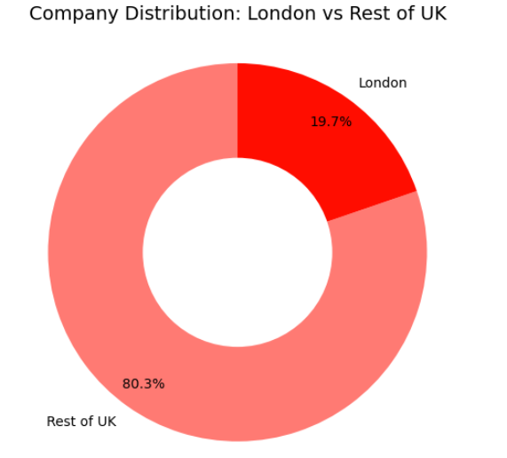
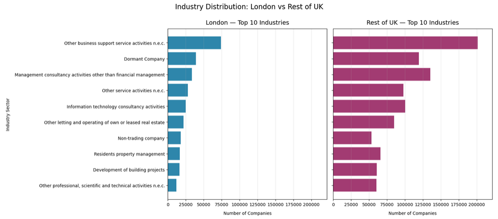

# 🇬🇧 UK Business Landscape: Industry Mapping & Spatial Analysis

Analyzing geographic distribution of UK companies by SIC code using postcode validation and spatial visualization.

## 📊 Dataset Sources

| File | Source | Description |
|------|--------|-------------|
| `AllCompanies2.csv` | [Kaggle: All UK Active Companies By SIC And Geolocated](https://www.kaggle.com/datasets/dalreada/all-uk-active-companies-by-sic-and-geolocated/data) | ~3.8M UK companies with postcode, coordinates, and SIC code (2017 snapshot) |
| `SIC07_CH_condensed_list_en.csv` | [UK Gov: SIC 2007 Reference](https://www.gov.uk/government/publications/standard-industrial-classification-of-economic-activities-sic) | Official condensed list of SIC 2007 codes with descriptions |

## 📈 Key Visualizations

### Business Density Across UK



Hexbin plot with logarithmic scale reveals major UK business hubs: London, Manchester, Birmingham, Glasgow, Edinburgh, Cardiff, and Belfast.

### Regional Comparison: London vs Rest of UK



~20% of UK companies are registered in London, confirming its role as the primary business hub.

### Industry Distribution by Region



Professional services (consulting, IT, business support) dominate both regions, reflecting the UK's service-oriented economy.

## 🚀 How to Reproduce

1. **Clone the repository:**
    ```bash
    git clone <your-repo-url>
    cd <repo-folder>
    ```
2. **Install dependencies:**
    ```bash
    pip install -r requirements.txt
    ```
3. **Download source:**
    - Place `AllCompanies2.csv` in the project root (or update the path in the notebook)
    - Place `SIC07_CH_condensed_list_en.csv` in the project root
4. **Run the notebook:**
    - Open `uk_business_industry_spatial_analysis.ipynb` in Jupyter Lab / VS Code / Google Colab
    - Execute all cells (`Kernel → Run All`)
5. **Output:**
    - The enriched dataset `companies_with_industry.csv` will be automatically generated in the project root
    - All visualizations will render inline

### 📁 Project Structure

```text
├── uk_business_industry_spatial_analysis.ipynb     # Main analysis notebook
├── companies_with_industry.csv                     # Generated: enriched dataset (do not commit if >100MB)
├── AllCompanies2.csv                               # Source: raw company data (download from Kaggle)
├── SIC07_CH_condensed_list_en.csv                  # Source: official SIC reference (download from gov.uk)    
├── images/                                         # Visualization screenshots for README
├── requirements.txt                                # Python dependencies
├── .gitignore                                      # Files to exclude from version control
└── README.md   
```

### 🎯 Key Objectives

1. Validate UK postcode format and assign regions (London vs Rest-of-UK)
2. Visualize national business density using latitude/longitude coordinates
3. Compare industry distribution between London and Rest-of-UK using SIC codes
4. Enrich dataset with official SIC 2007 descriptions and export cleaned version


### 📋 Requirements

- Python 3.10+
- pandas, matplotlib, seaborn
- Jupyter Lab or compatible environment

See `requirements.txt` for exact versions.

### 📈 Key Findings

- **Data Quality:** 99.98% postcode validity, 97.4% successful SIC→Industry mapping
- **Geographic Split:** ~20% of companies registered in London, ~80% in Rest-of-UK 
- **Industry Structure:** Professional services dominate both regions (consulting, IT, business support)
- **Dormant Entities:** 4.17% of companies marked as "Dormant" — reserved/inactive rather than operational

### 📄 License

- **Analysis code:** MIT License
- **Source data:** CC0: Public Domain (via Kaggle & Companies House UK)

---

*Portfolio project by Evgeniya Stolyarova*
